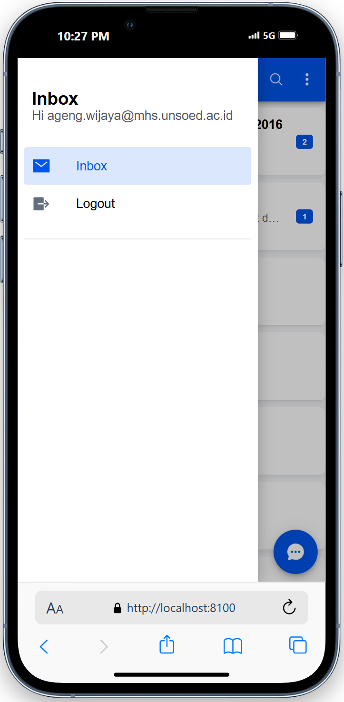

# FirstApp Ionic

Tugas pertemuan 6 praktikum pemrograman mobile membuat aplikasi pertemuan dengan framework Ionic.

## Screenshots

<p>
  
  
</p>

## Langkah-Langkah Menambahkan Komponen

### 1. Header Komponen

```typescript
// Tambahkan di file HTML
<ion-header>
  <ion-toolbar color="primary">
    <!-- Komponen header -->
  </ion-toolbar>
</ion-header>
```

### 2. Tombol Menu dan Navigasi

```typescript
<ion-buttons slot="start">
  <ion-menu-button id="menu-button"></ion-menu-button>
</ion-buttons>

<ion-title>Inbox</ion-title>

<ion-buttons slot="end">
  <ion-button>
    <ion-icon name="search-outline"></ion-icon>
  </ion-button>
  <ion-button>
    <ion-icon name="ellipsis-vertical"></ion-icon>
  </ion-button>
</ion-buttons>
```

### 3. Daftar Pesan (Konten)

```typescript
<ion-content fullscreen>
  <ion-list lines="full">
    <ion-item-sliding *ngFor="let chat of chatList">
      <ion-item (click)="openChat(chat)">
        <!-- Detail Item -->
      </ion-item>

      <ion-item-options side="end">
        <ion-item-option color="danger">
          <ion-icon name="trash"></ion-icon>
          Delete
        </ion-item-option>
      </ion-item-options>
    </ion-item-sliding>
  </ion-list>
</ion-content>
```

### 4. Floating Action Button

```typescript
<ion-fab vertical="bottom" horizontal="end" slot="fixed">
  <ion-fab-button (click)="newMessage()">
    <ion-icon name="chatbubble-ellipses"></ion-icon>
  </ion-fab-button>
</ion-fab>
```

### 5. Implementasi di Komponen TypeScript

```typescript
interface Chat {
  id: string;
  name: string;
  avatar: string;
  lastMessage: string;
  time: Date;
  unreadCount: number;
}

@Component({
  selector: "app-folder",
  templateUrl: "./folder.page.html",
  styleUrls: ["./folder.page.scss"],
})
export class FolderPage implements OnInit {
  chatList: Chat[] = [
    {
      id: "1",
      name: "Ageng Praba Wijaya | H1D022016",
      avatar: "assets/avatars/ageng.jpg",
      lastMessage: "Bro besok jadi jogging ga?",
      time: new Date(),
      unreadCount: 2,
    },
    {
      id: "2",
      name: "Mayor Bahlil",
      avatar: "assets/avatars/mayor_bahlil.jpg",
      lastMessage: "Pak minta tambahan anggaran buat dana koperasi",
      time: new Date(),
      unreadCount: 1,
    },
    {
      id: "3",
      name: "Fufufafa",
      avatar: "assets/avatars/fufufafa.jpg",
      lastMessage: "susunya susu",
      time: new Date(),
      unreadCount: 0,
    },
    {
      id: "4",
      name: "Pak Putin",
      avatar: "assets/avatars/pak_putin.jpeg",
      lastMessage: "I will deport you to the Gulag!",
      time: new Date(),
      unreadCount: 0,
    },
    {
      id: "5",
      name: "Cha Ie Minh",
      avatar: "assets/avatars/cak_imin.jpg",
      lastMessage: "Tak slepet kamu mas",
      time: new Date(),
      unreadCount: 0,
    },
    {
      id: "6",
      name: "SuToYo",
      avatar: "assets/avatars/STY.jpeg",
      lastMessage: "King Indo siap membantai MU",
      time: new Date(),
      unreadCount: 0,
    },
    {
      id: "7",
      name: "Yanto Galon",
      avatar: "assets/avatars/galon.jpeg",
      lastMessage: "Galon abis mas?",
      time: new Date(),
      unreadCount: 0,
    },
  ];

  constructor(private navCtrl: NavController) {}

  ngOnInit() {}

  openChat(chat: Chat) {
    this.navCtrl.navigateForward(`/chat/${chat.id}`, {
      queryParams: {
        name: chat.name,
        avatar: chat.avatar,
      },
    });
  }

  newMessage() {
    this.navCtrl.navigateForward("/new-message");
  }
}
```
